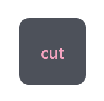

# Tablet Friend


### [DOWNLOAD](https://github.com/Martenfur/TabletFriend/releases/latest)

### [SAMPLE LAYOUT](TabletFriend/TabletFriend/files/layouts/sample_layout.yaml)

### [VIDEO GUIDE](https://www.youtube.com/watch?v=rWkRrhrKmSY)

Hey there! Working without a keyboard is hard. When you are on a tablet, you realize how much you miss certain key combinations. Well, no more! Tablet Friend will make your life on Surface Pro or any other Windows tablet easier by providing a highly customizable set of on-screen toolbars.

Whether you are an artist, a casual Windows tablet fan or simply a touchscreen enjoyer, Tablet Friend is the perfect companion for getting stuff done. 


Here's what Tablet Friend can do:

- Press buttons and button combinations.
- Toggle buttons.
- Type.
- Press and hold buttons.
- Execute command line commands - this allows you to launch any programs you wish or make custom scripts that do exactly what you want. Batch, Powershell - the sky is the limit.
- Swap and link layouts seamlessly.
- Chain any number of actions.
- Use over 4000 built-in vector icons from [https://materialdesignicons.com](https://materialdesignicons.com) or arbitrary png icons.
- Dock the toolbar to the side or on top.
- Simply look nice. :)


## Getting started

Grab the latest release from [this page](https://github.com/Martenfur/TabletFriend/releases/latest), unzip it... and that's it! No multistep installations, no hassle, you can start using the thing right away. 

## Making your own toolbars

Let's be honest - the default toolbars will probably not be enough for you. But that's ok. It's you who knows best what you need, this is why Tablet Friend is a great toolbar constructor first and a great toolbar second.

First, right-click the tray icon and press the 'open files directory' button. 


This will open a directory with a bunch of `.yaml` files. These are your toolbars - you can open them with any text editor you like. I know, I know, editing some config files directly may seem scary - luckily, Tablet Friend makes it as easy and intuitive as possible. 

Let's make a new toolbar - create a file named `my_toolbar.yaml` in the `toolbars` directory, open it and paste this inside:

```yaml
buttons:
	cut_button:
		action: ctrl+x
		text: cut
 ```

Yes, it's that simple. Let's break down what we just wrote: `buttons` is a collection of buttons. This is where all your buttons will go. `cut_button` is the name of your button. **Note that all button names should be unique.** Its `action` is a ctrl+x press. And it will display `text` that says "cut" on it. Now, right-click Tablet Friend toolbar and choose "my toolbar" from the list. You don't need to relaunch the program - it updates everything automatically. If you did everything correctly, you will see this:



In just four lines, we got ourselves a working button! But obviously, this is not enough for a functional toolbar. Let's add some more and some cosmetics:

```yaml
buttons:
	cut_button:
		action: ctrl+x
		text: cut
	copy_button:
		action: ctrl+c
		text: copy
	paste_button:
		action: ctrl+v
		text: paste
		size: 2,1	
 ```

Now, press `Ctrl+S` and your toolbar will update automatically. Magic!


Paste button is wider that the others, because its `size` is 2 cells wide and 1 cell high. You also may wonder how do you specify button positions. That's the best thing - you don't. Instead of tediously calculating all the positions by hand, you let Tablet Friend handle this for you. 

All buttons are put on the layout from left to right in a single line - until they run out of space. Every layout has a property called 'layout_width'. It tells the layout how many cells it has before it will be forced to put buttons on a second line. By default, this value is 2, but you can change it. Simply paste this on the very first line of your config:

```yaml
layout_width: 4
```

Press Ctrl+S and your layout will change to this:


Because there is enough space now, all buttons can fit on the same line. You can play around and see what happens at different button sizes, layout width and button amounts. This system is very intuitive once you get the hang of it.

However, what if you want to space out your buttons, or create a specific shape out of your buttons? For that, Tablet Friend has spacers. Change your config to look like this:

```yaml
layout_width: 2
buttons:
	cut_button:
		action: ctrl+x
		text: cut
	copy_button:
		action: ctrl+c
		text: copy
	spacer1:
		spacer: true
		size: 2,1
	paste_button:
		action: ctrl+v
		text: paste
		size: 2,1	
		style: accent # Let's also change this button's style to something different.
 ```

Press Ctrl+S and your toolbar will now have a line of space in-between the buttons:


`Spacer` stacks just like buttons, but instead of a button, it creates empty space. The only valid property for it is `size`. Using spacers, you can create absolutely any shape and layout you want. 

It is **VERY IMPORTANT** that you use tab characters `	`  instead of spaces for your indents. Indents do matter, since they tell the config what should go where. You *can* use spaces if you really want to, but keep in mind that all the default layouts use tabs, and tabs and spaces **should never mix** in one config. 

### App-specific layouts

Having a layout is great but what if you want to have one layout for your drawing app, another for note taking and a completely separate one for web browsing? You're in luck because since version 2.0, Tablet Friend has app-specific layout support!

Simply add this line to the top of your layout config:
```yaml 
app: mspaint
```
And now, every time we open Microsoft Paint, the layout will automatically switch to this one. But how do we know what exact name an app has? 
For this, you must focus on the app you want, right-click the Tablet Friend tray icon, select `settings` and look at the `focused app` label. It always tells the app you're focusing on. 


You can also use wildcards:
```yaml
app: app_name     # Will match only app_name exactly.
app: app_name*    # Will match any app name that starts with app_name. For example, app_name_v_1.0
app: "*app_name*" # Will match any app name that contains app_name. Note that if you're putting a * symbol in the beginning, you need to use quotes. 
```

If you switch to an app that doesn't have an app-spesific layout, it will switch to the last manually selected layout. 

You can also disable automatic switching altogether by going into `settings` and pressing the `disable per-app layouts` button.

**NOTE**: In order for transition between layouts to be smooth and quick, `layout_width`, `button_size` and `margin` should be exactly the same between layouts.

This, of course, are not all the features Tablet Friend offers. You can check out a more [advanced example](TabletFriend/TabletFriend/files/layouts/sample_layout.yaml) with all features listed.

## Migrating to 2.0

Starting with the version 2.0.0, layout-specific themes are no longer supported. Instead, you can choose a theme in the context menu that will be applied to all toolbars. 


This means, the layout structure has changed a little bit. 

- Layout properties `external_theme` and `theme` no longer work.
- Theme properties `button_size`, `margin`, `min_opacity`, `max_opacity` have been moved directly to layout yaml. Themes can no longer influence these properties.

An example of 1.0 to 2.0 migration for a layout:

```yaml
# old layout
layout_width: 4
external_theme: files/themes/default.yaml
theme:
	button_size: 14

buttons:
	hide:
		action: a
		text: "a"

# new layout
layout_width: 4
button_size: 14
margin: 8

buttons:
	hide:
		action: a
		text: "a"

```

Note that unmodified 1.0 layouts and themes will still function but may get rendered differently.

## Making Tablet Friend better

Tablet Friend is opensource, licensed under MIT and 100% free. You can help out the development by submitting your own toolbars to the [issues](https://github.com/Martenfur/TabletFriend/issues) board or helping out with the code. 

If you have any questions, you can contact me at `chaifoxes@gmail.com`
